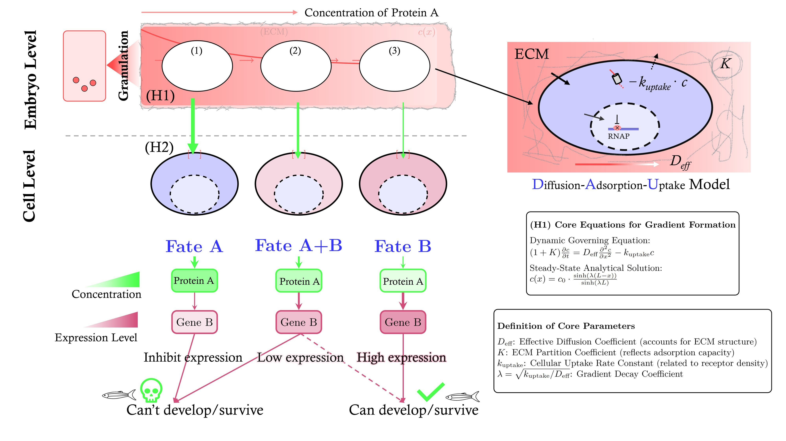

# Morphogen-DAU-Model: Diffusion-Adsorption-Uptake Model for Morphogen Validation

## 🔬 Project Overview

This repository presents the **Diffusion-Adsorption-Uptake (DAU) Model**, a rigorous theoretical and computational framework designed to efficiently analyze and validate whether a target protein fulfills the core properties of a **Morphogen**.

The validation of a morphogen is fundamentally governed by two core hypotheses:

1.  **Hypothesis 1 (H1: Gradient Formation)**: The protein must establish a stable, spatial concentration gradient across the tissue.
2.  **Hypothesis 2 (H2: Concentration-Dependent Regulation)**: Cells must respond to this concentration gradient in a dosage-dependent manner, activating distinct gene expression profiles in different concentration zones to specify cell fate.

The DAU Model is strictly derived from first-principle physics and higher mathematics, providing a necessary, minimal coarse-graining of the dynamics. It describes the key processes of **Diffusion ($D$)**, **Adsorption/Binding ($K$)**, and **Cellular Uptake/Degradation ($k_{\text{uptake}}$)** of the morphogen within an embryonic tissue, enabling efficient quantification and prediction of its kinetic parameters from experimental data.

## ⚙️ Model Schematic (model.jpg)

To provide an intuitive understanding of the model's components and processes, the DAU model schematic is included below.


<p align="center">Figure 1. Schematic of the DAU Model. The morphogen (C) undergoes Diffusion (D) in the extracellular space, non-endocytic Adsorption/Binding (K), and cellular Uptake/Degradation (k_uptake).</p>


## 📜 Core Model Derivation

### 1. The Governing Partial Differential Equation (PDE)

Considering a 1D spatial domain ($x \in [0, L]$), the dynamic change in morphogen concentration $C(x, t)$ is governed by the following PDE:

$$
(1 + K) \frac{\partial C}{\partial t} = D \frac{\partial^2 C}{\partial x^2} - k_{\text{uptake}} C
$$

Where:
* $C(x, t)$: Morphogen concentration at position $x$ and time $t$.
* $D$: The effective diffusion coefficient of the morphogen in the extracellular space.
* $K$: The **binding constant** (dimensionless) for non-endocytic binding of soluble morphogen to the extracellular matrix or cell surface.
* $k_{\text{uptake}}$: The **first-order rate constant** for endocytosis or degradation.
* The $(1+K)$ term: Accounts for the **buffering effect** of the surface/matrix-bound pool, effectively defining the **effective diffusivity** $D_{\text{eff}} = \frac{D}{1+K}$.

### 2. The Steady-State Analytical Solution for H1 (The Gradient)

When the system reaches a steady state ($\partial C / \partial t = 0$), the PDE simplifies to an Ordinary Differential Equation (ODE):

$$
D \frac{d^2 C}{d x^2} - k_{\text{uptake}} C = 0
$$

**Detailed Derivation:**

Rearranging the ODE:
$$
\frac{d^2 C}{d x^2} = \frac{k_{\text{uptake}}}{D_{\text{eff}}} C = \mu^2 C
$$
Where the **characteristic decay parameter** $\mu$ is defined as:
$$
\mu = \sqrt{\frac{k_{\text{uptake}}}{D_{\text{eff}}}}
$$

The general solution is in the form:
$$
C(x) = A \cosh(\mu x) + B \sinh(\mu x)
$$

Applying Boundary Conditions:
* **Source Boundary (at $x=0$)**: $C(0) = C_0$ (Constant release concentration)
* **Far-End Boundary (at $x=L$)**: $C(L) = 0$ (Zero concentration/perfect sink)

1.  Substituting $C(0) = C_0$:
    $$
    C_0 = A \cosh(0) + B \sinh(0) \implies A = C_0
    $$

2.  Substituting $C(L) = 0$:
    $$
    0 = C_0 \cosh(\mu L) + B \sinh(\mu L) \implies B = -C_0 \frac{\cosh(\mu L)}{\sinh(\mu L)}
    $$

The final steady-state analytical solution (rearranged for clarity) is:

$$
C_{\text{steady}}(x) = C_0 \frac{\sinh \left( \mu (L-x) \right)}{\sinh \left( \mu L \right)}
$$

The **Characteristic Decay Length ($\lambda$)** of the morphogen gradient is $\lambda = 1/\mu$, quantifying the spatial extent of the gradient.


## 💻 Code and File Structure

| Filename | Description | Key Functionality |
| :--- | :--- | :--- |
| `src/stimulate1.2.py` | **H1 Validation Script** | Simulates the dynamic formation of the morphogen gradient using the Finite Difference Method (FDM) and analyzes the influence of parameters like $D$, $k_{\text{uptake}}$, and $K$ on the steady state and half-life ($T_{1/2}$). |
| `src/stimulate1.3.py` | **H2 Validation Script** | Analyzes the impact of the steady-state concentration gradient on downstream gene expression (H2), and simulates boundary shifts under perturbations of **Source Concentration ($C_0$)** and **Tissue Length ($L$)**. |
| `paper.pdf` | **Original Paper** | Contains the full model derivation, parameter selection, and associated wet-lab experimental protocols. |
| `requirements.txt` | **Dependencies** | List of Python libraries required to run the simulation scripts. |

## 🚀 How to Run the Code

### 1. Environment Setup

Ensure you have Python 3 and the necessary scientific computing libraries installed:

```bash
pip install -r requirements.txt
